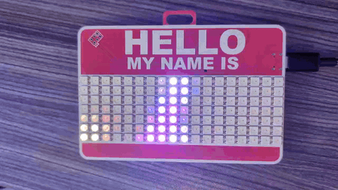
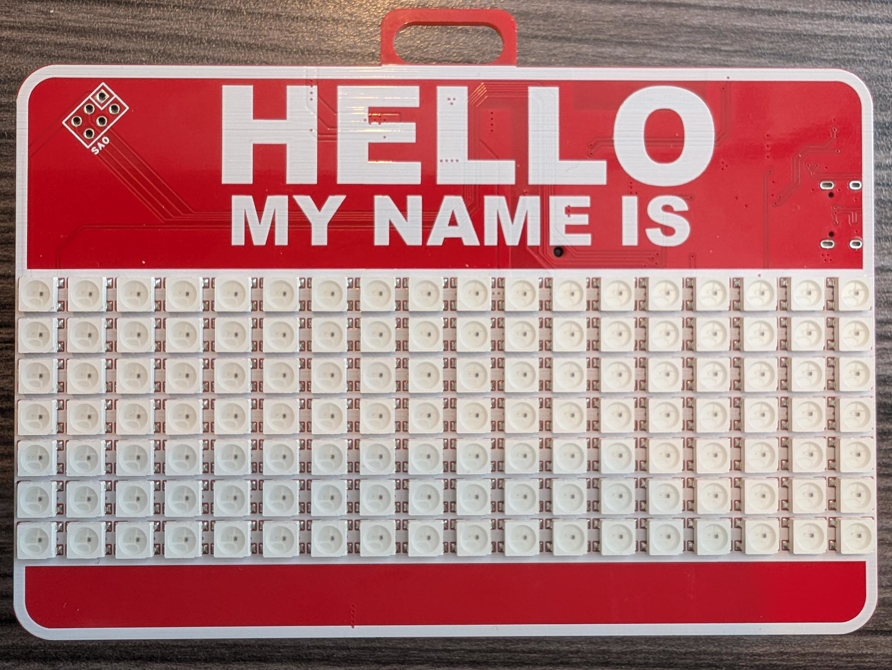
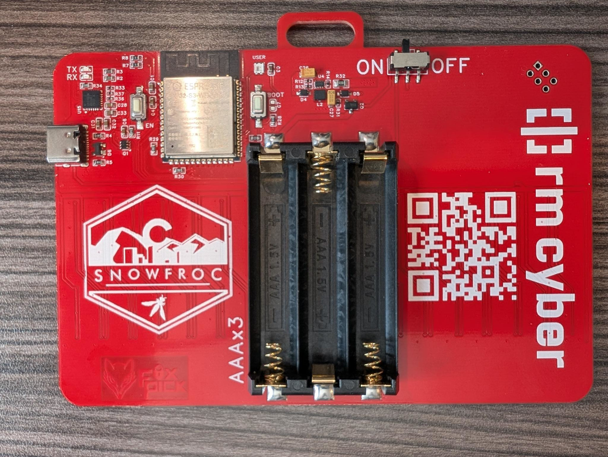
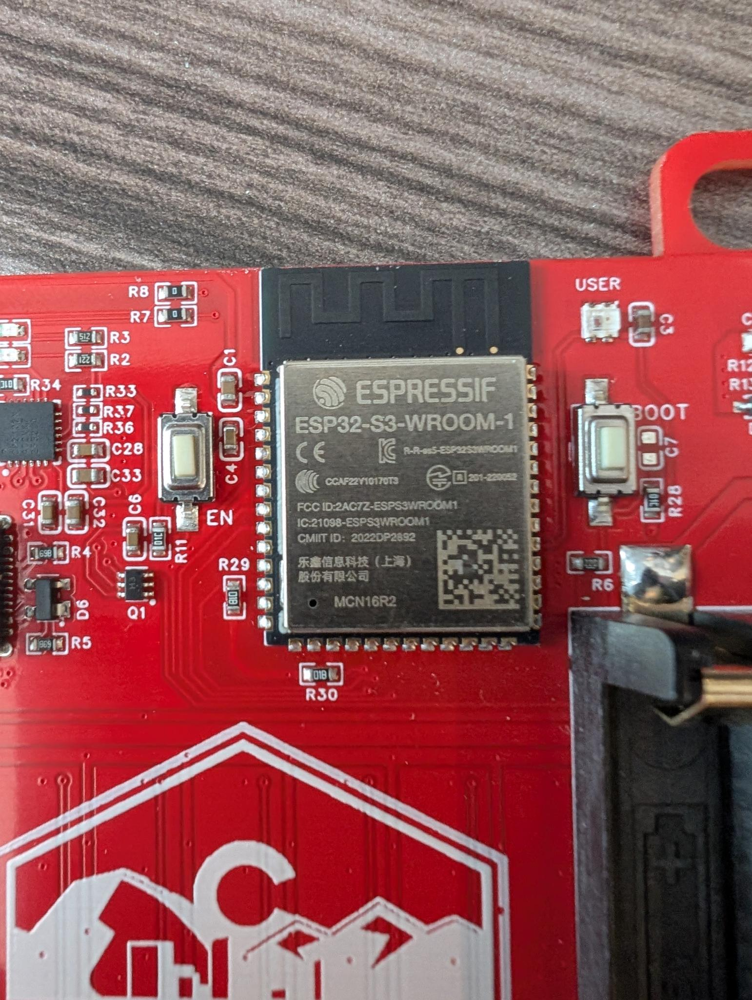

# SnowFroc2026 Badge - WLED

This repository has a claude skill that installs WLED to the [SnowFroc](https://snowfroc.com/) 2026 badge. The badge was created by https://rm-cyber.com/. I was a conference attendee.




## Yolo quickstart

Connect your badge to your computer. Then:

```sh
# clone repository
git clone [thisrepository] && cd [thisrepository]

# start claude session
claude 

# start skill
/flash-wled-snowfroc-2026-badge
```


## About the badge

 

 




The badge uses an `ESP32-S3` configured with an eFuse that forces `QSPI` flash mode.

The badge includes a WS2182B pixel matrix on the front, and a separate single WS2182B LED pixel on the back.

The badge can be powered by either batteries, or USB. If USB power is present, batteries can be removed.

There is an **ON/OFF** switch on the back of the badge which must be in the "ON" position for the chip to be powered (even when powering via USB)

On the back of the board, next to the ESP32, there is a **BOOT** button to the right, and a **EN/RST** button to the left. The skill requires interacting with these buttons.


## About the repository

This repository bundles `WLED_0.15.4_ESP32-S3_4M_qspi.bin`, and `WLED` config files compatible with that version which are restored after `WLED` is flashed.

The repository does not include a full flash dump of the original badge firmware. Creating that dump from your badge is one of the skill steps.


## About the skill

Before starting the skill, connect your badge to your computer via the badge's USB-C port.


**User physical interactivity required**

The skill requires physical interaction at various points with the **BOOT** and **EN/RST** buttons on the back of the badge board.

The skill also requires that the user connect to the WLED access point after WLED is flashed.


**Running the skill**

The skill can be run from a container, as long as the badge device is available within the container. 

The skill uses `esptool`. It requires that the invoking user be able to interact with the device (e.g., on Linux, that the user is a member of the `dialout` group).

To run the skill, clone this repository, and then run the skill like this from within a claude session:

```
/flash-wled-snowfroc-2026-badge
```


## Miscellaneous

### WLED LED outputs — Config → LED Preferences

GPIO for the LED matrix on the front is `17`

GPIO for the picoled on the back is `38`


#### LED 1 — 7×18 front matrix

| Setting      | Value    |
|--------------|----------|
| LED type     | `WS281x` |
| Color order  | `GRB`    |
| GPIO         | `17`     |
| Count        | `126`    |

#### LED 2 — picoled (single onboard LED)

| Setting      | Value    |
|--------------|----------|
| LED type     | `WS281x` |
| Color order  | `GRB`    |
| GPIO         | `38`     |
| Count        | `1`      |

### 2D layout — Config → LED Preferences → 2D Configuration

| Setting       | Value        |
|---------------|--------------|
| Panels        | `1`          |
| Width         | `18`         |
| Height        | `7`          |
| Serpentine    | `off`         |
| First pixel   | `top-left`   |
| Orientation   | `horizontal` |
